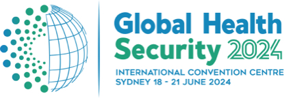

# Basics of data analysis and visualization for global health security

**Aim and objectives:**  This workshop will build literacy in statistical programming, with a focus on understanding the skills needed to conduct reliable data analyses and design data visualizations to inform efforts in global health security. 

We will introduce tools for data analysis and visualization (Excel, Tableau, Python, and R) and describe how they can be used to help more deeply understand and communicate about data. Participants will leave with a basic understanding of exploratory data analysis and best-practices for designing data visualizations. Examples will be shown using the programming language R, and users will leave with suggestions for additional free and publicly available resources to support self-directed learning.

**Preferred target audience:** This workshop is designed for policymakers, civil society representatives, healthcare workers, and data analysts with a basic understanding of how data can be used to inform decision making. The workshop will discuss the open-source programming language R, though no prior experience with R is required.

This workshop is part of the [2024 Global Health Security Conference in Sydney Australia](https://www.ghsconf.com/preliminary-program/).

If you have questions, feel free to reach out at sde31@georgetown.edu. 